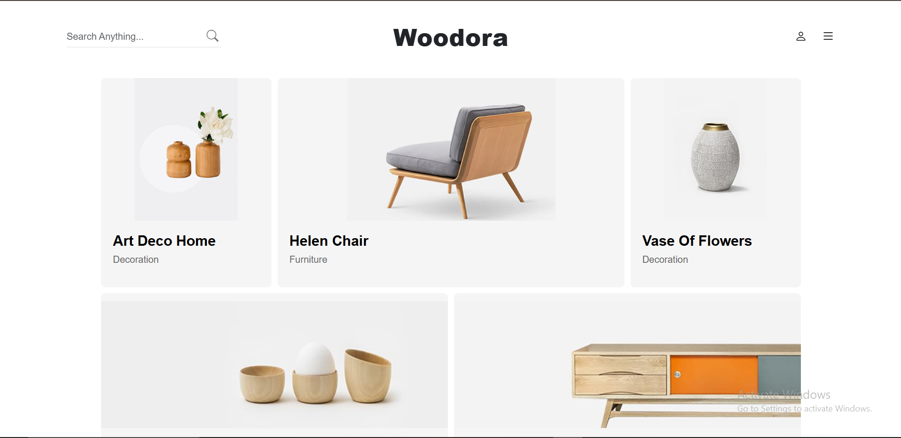
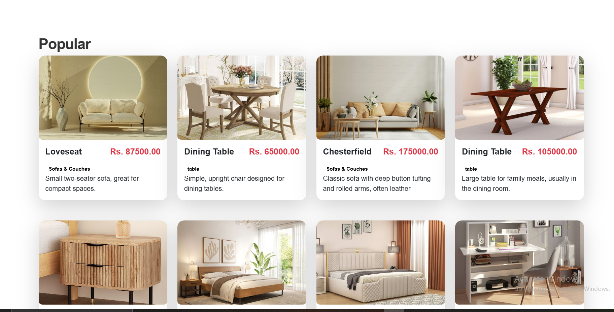

# Woodora Furniture Showroom Management System

## 📌 Project Overview
Woodora Furniture is a modern and user-friendly **web-based showroom management system**.  
The system enables customers to browse furniture collections, view product details, place orders, and send inquiries.  
An **admin dashboard** allows the business owner or staff to manage products, track orders, interact with customers, and monitor showroom performance.

---

## 👤 Student Details
- **Name:** B. Eranga Priyankara Fernandu
- **ID:** 241711033

---

## 🎯 Project Objective
The primary objective of this project is to build a **fully functional, responsive, and secure furniture showroom system** that enhances customer experience and improves operational efficiency.

---

## ✨ Features

### Customer Side
- 🔐 User registration & login
- 🔍 Search all furniture items
- 🛋️ View product details, prices, and availability
- 🛒 Add items to cart & make purchases
- 🎨 Filter furniture by material, type, color, etc.
- 📝 Submit inquiries or requests for custom furniture
- 📅 Book showroom consultation or delivery
- ⭐ Provide feedback & ratings
- 🔔 Receive notifications about special offers

### Admin Module
- 🔑 Secure admin login
- ➕➖ Manage furniture products (add/edit/delete)
- 🗂️ Manage categories & stock levels
- 📦 View & manage customer orders and consultations
- 📊 Track sales reports & analytics (most viewed, most sold items)
- 💬 Handle customer feedback & inquiries
- 🖼️ Upload promotional banners & announcements
- 🔔 Receive notifications for low stock, new inquiries, etc.

---

## 🛠️ Technologies Used
- **Frontend:** HTML, CSS, JavaScript, Bootstrap, jQuery
- **Backend:** Java, Spring Boot
- **Database:** MySQL
- **Other Tools:** AJAX

---

## 📈 Expected Outcome
- Smooth and engaging **online furniture shopping experience**
- Online booking for **consultations and deliveries**
- Easy **inventory & order management** for administrators
- A **clean, responsive interface** for desktop & mobile
- Strong **online presence** for Woodora with improved efficiency

---

## 🚀 Future Enhancements
- Integration with **payment gateways**
- AI-powered **product recommendation system**
- Mobile application (Android/iOS)
- Multi-language support

---
# Woodora Furniture Showroom Management System

## 📌 Project Overview
Woodora Furniture is a modern and user-friendly **web-based showroom management system**.  
The system enables customers to browse furniture collections, view product details, place orders, and send inquiries.  
An **admin dashboard** allows the business owner or staff to manage products, track orders, interact with customers, and monitor showroom performance.

---

## 👤 Student Details
- **Name:** B. Eranga Priyankara Fernandu
- **ID:** 241711033

---

## 🎯 Project Objective
The primary objective of this project is to build a **fully functional, responsive, and secure furniture showroom system** that enhances customer experience and improves operational efficiency.

---

## ✨ Features

### Customer Side
- 🔐 User registration & login
- 🔍 Search all furniture items
- 🛋️ View product details, prices, and availability
- 🛒 Add items to cart & make purchases
- 🎨 Filter furniture by material, type, color, etc.
- 📝 Submit inquiries or requests for custom furniture
- 📅 Book showroom consultation or delivery
- ⭐ Provide feedback & ratings
- 🔔 Receive notifications about special offers

### Admin Module
- 🔑 Secure admin login
- ➕➖ Manage furniture products (add/edit/delete)
- 🗂️ Manage categories & stock levels
- 📦 View & manage customer orders and consultations
- 📊 Track sales reports & analytics (most viewed, most sold items)
- 💬 Handle customer feedback & inquiries
- 🖼️ Upload promotional banners & announcements
- 🔔 Receive notifications for low stock, new inquiries, etc.

---

## 🛠️ Technologies Used
- **Frontend:** HTML, CSS, JavaScript, Bootstrap, jQuery
- **Backend:** Java, Spring Boot
- **Database:** MySQL
- **Other Tools:** AJAX

---

## 📈 Expected Outcome
- Smooth and engaging **online furniture shopping experience**
- Online booking for **consultations and deliveries**
- Easy **inventory & order management** for administrators
- A **clean, responsive interface** for desktop & mobile
- Strong **online presence** for Woodora with improved efficiency

---

## 🚀 Future Enhancements
- Integration with **payment gateways**
- AI-powered **product recommendation system**
- Mobile application (Android/iOS)
- Multi-language support

---

https://youtu.be/bkyzhLR0c9Q